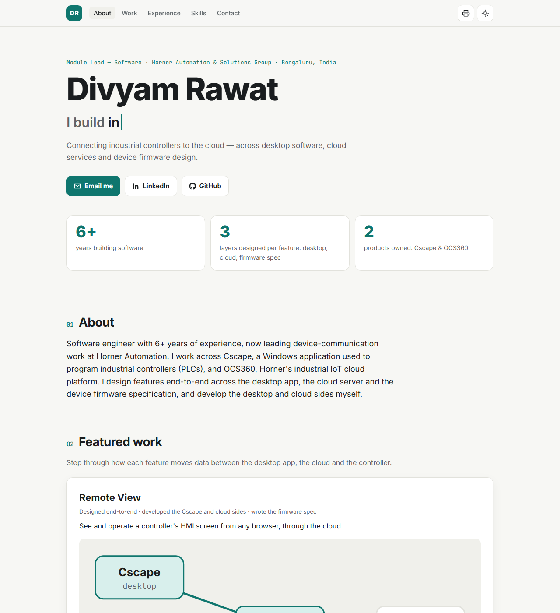

# Divyam Rawat — Interactive Resume

**Live site → [drawat123.github.io](https://drawat123.github.io/)**

Module Lead at Horner Automation, working on industrial IoT and PLC-to-cloud connectivity across
desktop software (C++/MFC), cloud services (Java/Spring Boot, Angular) and device firmware design.



## Highlights

- **Interactive data-flow diagrams:** step through how Remote View and Remote Connect move data between the
  desktop app, the cloud and the controller, with an animated packet for each hop.
- **Skill filter:** pick a skill to highlight the projects and roles that use it.
- **Expandable experience timeline**
- **Light and dark themes:** follows the system setting and remembers your choice.
- **Save as PDF:** prints a clean one-column resume.
- **Responsive and accessible:** works down to phone width, supports keyboard navigation and respects reduced-motion settings.

## Built with

Plain HTML, CSS and JavaScript. No framework, no build step and no dependencies apart from Google Fonts.

## Project structure

```
portfolio/
├── index.html       # page skeleton
├── styles.css       # layout, themes, print styles
├── app.js           # renders content; diagrams, filter, timeline, theme
├── data.js          # ALL resume content, the only file to edit for updates
└── assets/
    └── preview.png  # README screenshot
```

## Updating the content

Everything shown on the site lives in **`data.js`**: the summary, featured work (including each diagram's
nodes and steps), projects, experience, skills and education. Edit it, commit, and push. GitHub Pages
redeploys automatically.

## Run locally

Open `index.html` in a browser, or serve the folder:

```sh
python -m http.server 8000   # then open http://localhost:8000
```

## Deploy (GitHub Pages)

```sh
git init
git add .
git commit -m "Interactive resume"
git branch -M main
git remote add origin https://github.com/drawat123/drawat123.github.io.git
git push -u origin main
```

Then on GitHub go to **Settings → Pages → Build and deployment**, set **Source** to **Deploy from a branch**,
choose **`main` / `(root)`** and click **Save**. The site goes live at `https://drawat123.github.io/`
within a minute or two.

## Contact

- Email: [divyamrawat325@gmail.com](mailto:divyamrawat325@gmail.com)
- LinkedIn: [divyam-rawat-7a232a114](https://www.linkedin.com/in/divyam-rawat-7a232a114)
- GitHub: [@drawat123](https://github.com/drawat123)
